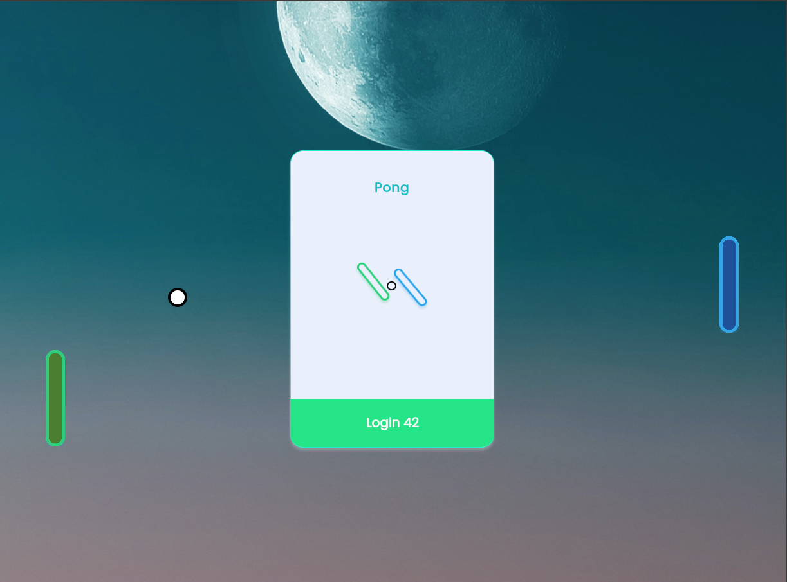

# trancendance42

## Vidéo de présentation

  <source src="https://www.youtube.com/watch?v=GV_ROvB304o" type="video/mp4">
</video>

## Introduction

Création d'un site web pour un jeu en ligne « PONG », avec un chat privé et public ainsi qu'une interface utilisateur

## Technologies utilisées

- React
- NestJs
- Typescrypt
- Prisma
- PostgreSQL
- CSS
- Docker

### Description du projet

Le site doit être muni d'un chat, d'un jeu Pong, d'un système de compte utilisateur, et d'un système de sécurité.

### Le chat

- Créer des canaux (salles de chat) : publics, privés, ou protégés par un mot de passe.
- Propriétaire du canal:
  - L'utilisateur qui crée un nouveau canal devient automatiquement le propriétaire du canal.
  - Peut définir un mot de passe pour accéder au canal, le modifier ou le supprimer.
  - Celui qui est administrateur du canal. Il peut définir d'autres utilisateurs comme administrateurs.
  - Les administrateurs d'un canal peuvent bannir ou rendre muets des utilisateurs pour une durée limitée.
    - Envoyer des messages directs à d'autres utilisateurs.
    - Bloquer d'autres utilisateurs.
    - Ne plus voir les messages provenant du compte bloqué.
    - Inviter d'autres utilisateurs à jouer à une partie de Pong via l'interface de chat.
    - Pouvoir accéder aux profils des autres joueurs via l'interface de chat.

### Le jeux Pong

- Jouer une partie de Pong en direct contre un autre joueur directement sur le site.
- Système de matchmaking

- L'utilisateur peut rejoindre une file d'attente jusqu'à ce qu'il soit automatiquement associé à un autre joueur.
- Jeu en canvas
- Options de personnalisation
  Par exemple, des power-ups ou différentes cartes.
- Sélectionner une version par défaut du jeu sans fonctionnalités supplémentaires s'il le souhaite.
- Le jeu doit être responsive.

### Compte utilisateur

- Utilisation du système OAuth de l'intranet 42.
- L'utilisateur doit pouvoir télécharger un avatar.
- L'utilisateur doit pouvoir activer l'authentification à deux facteurs.
- L'utilisateur doit pouvoir ajouter d'autres utilisateurs comme amis et voir leur statut actuel (en ligne, hors ligne, en jeu, etc.).
- Les statistiques doivent être affichées sur le profil utilisateur, telles que : victoires et défaites, niveau du classement, succès, etc.
- L'utilisateur doit avoir un historique des matchs comprenant les parties en 1v1, le classement, et d'autres informations utiles.
- Toute personne connectée doit pouvoir consulter cet historique.

### Sécurité

- Tout mot de passe stocké doit être haché.
- Utiliser un algorithme de hachage de mot de passe robuste.
- Le site web doit être protégé contre les injections SQL.
- Implémenter une validation côté serveur pour les formulaires et toute entrée utilisateur.
- Toute information sensible, telles que des identifiants, clés API, variables d'environnement, etc., doit être stockée localement dans un fichier .env et ignorée par git.
